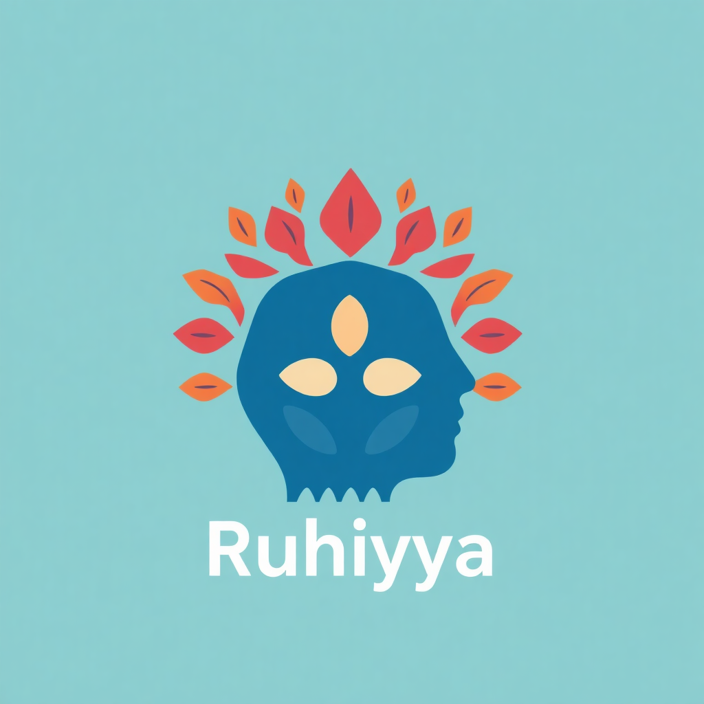

# Ruhiyyah 

   

Ruhiyyah is a web application designed to serve as a personalized, accessible, and location-based mental well-being assistant. By combining mood assessment, AI-driven recommendations, and geolocation services, we empower users to make informed decisions about their mental health in real-time.

---

## Key Features & Innovation:
- *Mood-Based Recommendations:* Users take a quick pre-test to evaluate their daily mood, and the system suggests suitable activities and places to visit based on their emotional state.  
- *Location-Aware Suggestions:* The app dynamically provides activity and place recommendations in the user's city, ensuring practical and accessible options.  
- *Knowledge Base for Mental Wellness:* A structured repository of resources, self-care techniques, and scientifically backed tips to help users understand and improve their mental health.  
- *Therapist Connection:* Users can access and contact mental health professionals directly through the platform.  
- *Inclusivity for Women:* The app considers specific needs, such as pregnancy, to provide safe and suitable recommendations tailored to different users.

 
